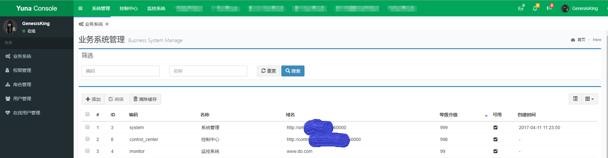
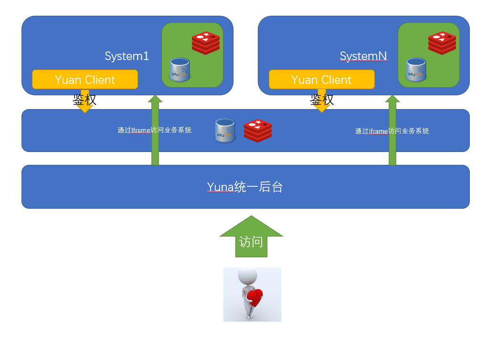
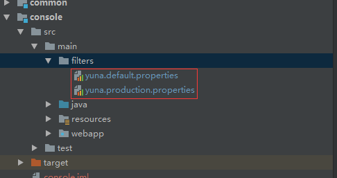
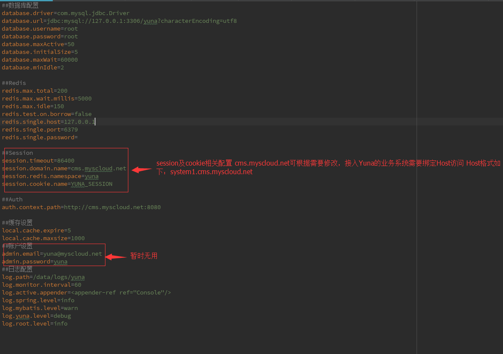
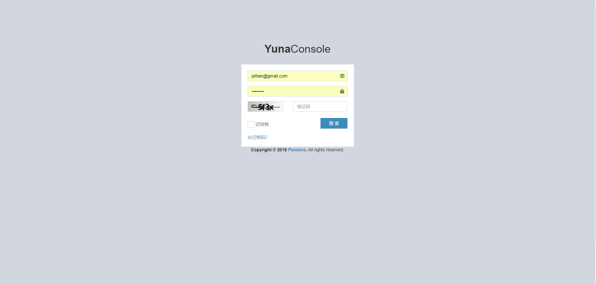
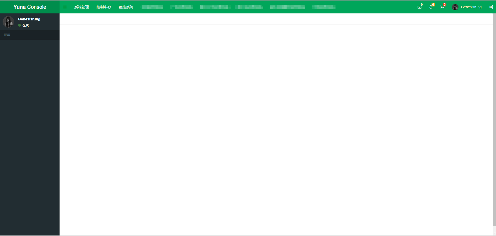
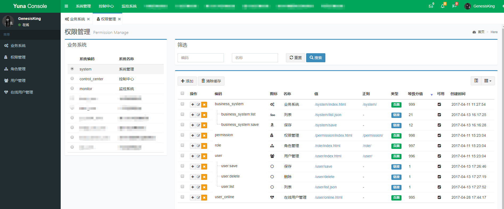

Yuna企业通用后台
===============


背景
-----------------------------------

考虑到公司业务系统较多，各业务系统后台各自开发维护用户及权限系统浪费开发资源，并且结合之前在公司做SSO的经验，决定开发一套基于Spring Session的统一管理后台来简化公司的业务系统

简介
-----------------------------------

Yuna是一套基于Spring Session技术搭建的统一后台管理系统，集统一登录、统一授权、统一管理于一体。
Yuna系统可帮助企业快速搭建微后台服务架构，各业务系统管理后台完全独立开发部署，只需集成Yuan Sdk就可以在Yuna后台统一管理授权


架构
-----------------------------------


（有些丑）

简单使用说明
-----------------------------------
* 导入files/sql/init.sql文件到mysql数据库
* 导入项目到IDE.
* 修改console模块下配置文件

  
  
* 启动项目,管理员账号在数据库中设置  默认管理员账号：admin@company.net 密码：12345678
  需绑定Host访问   
  127.0.0.1 cms.company.net
  
  登录地址 http://cms.company.net:8080 


平台目录结构说明
-----------------------------------
```
├─client: 业务系统接入Yuan平台的SDK
├─common: Yuna公共代码包含一些工具类等
├─console: Yuna核心代码，页面
├─domain: Model、Bean 
└─files: 项目文件 
   ├─screenshot: 系统截图 
   └─sql: 初始化SQL + DDL + DML
```
系统部分页面演示
-----------------------------------
系统登录


主页


业务系统管理


权限管理


配置外部系统(Grafana)
")

配置外部系统(Kibana)
")